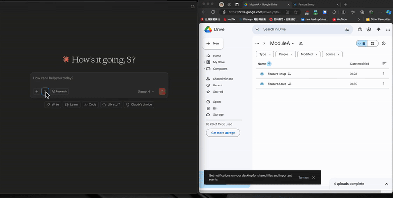

[](https://mseep.ai/app/taurus5650-mcp-mindmup2-google-drive)

# MindMup2 Google Drive MCP Server

A Model Context Protocol (MCP) server that provides seamless integration between MindMup mind maps and Google Drive. This server enables you to search, retrieve, and parse MindMup files stored in your Google Drive directly through the MCP interface.
- _Medium Article:_ https://medium.com/@shyinlim/using-google-drive-mindmup-mcp-to-review-test-cases-automatically-ee03f2e9272d

## 💫 Result


## ✨ Feature

- **Search MindMup Files**: Find MindMup files across your entire Google Drive or within specific folders (Currently supports read-only operations for MindMup files.)
- **Google Drive Integration**: List and filter files in Google Drive with various criteria
- **MindMup Parsing**: Parse and extract content from MindMup mind map files
- **FastMCP Server**: Built on FastMCP framework for high performance
- **Docker Support**: Containerized deployment with Docker Compose

## 🧠 Business Value

- **Unified Knowledge Management**: Centralize mind map access across Google Drive through a single MCP interface
- **Enhanced Productivity**: Quick search and retrieval of mind maps without switching between applications
- **Developer Integration**: Seamlessly integrate mind mapping capabilities into existing workflows and tools
- **Scalable Architecture**: Handle large collections of mind maps with efficient filtering and parsing
- **Cross-Platform Compatibility**: Access mind maps from any MCP-compatible client or application

## 🏗️ Project Structure

```
├── deployment/
│   ├── credential/
│   │   └── google_service_account.json # Google Cloud Service Account credentials
│   ├── docker-compose-dev.yml
│   ├── docker-compose-prod.yml
│   └── Dockerfile
├── src/
│   ├── core/
│   │   ├── gdrive_client.py   # Google Drive API client
│   │   ├── gdrive_feature.py  # Google Drive feature implementation
│   │   ├── mcp_server.py      # Main MCP server implementation
│   │   └── mindmup_parser.py  # MindMup file parsing
│   ├── model/
│   │   ├── common_model.py    # Common data models
│   │   ├── gdrive_model.py    # Google Drive data models
│   │   └── mindmup_model.py   # Mind map data models
│   └── utility/
│       ├── enum.py           # Enumerations and constants
│       └── logger.py         # Logging utilities
├── run.py                    # Main entry point
├── requirements.txt          # Python dependencies
└── makefile                 # Build and deployment commands
```

## 🚀 Getting Started

### Prerequisites
- Python 3.12+
- Google Cloud Platform account

### Google Drive API Setup
1. Go to [Google Cloud Console](https://console.cloud.google.com/)
2. Create a new project or select existing one
3. Enable [Google Drive API](https://console.cloud.google.com/apis/library/drive.googleapis.com)
4. Create Service Account credentials:
   - Go to "IAM & Admin" → "Service Accounts"
   - Click "Create Service Account"
   - Download the JSON key file
5. Place the JSON file at: `deployment/credential/google_service_account.json`

### Run the Server
For development:
```bash
make run-dev-docker
```

For production:
```bash
make run-prod
```
### MCP Client Configuration
Add this server to your MCP client configuration:

```json
{
  "mcpServers": {
    "mindmup-gdrive": {
      "command": "mcp-remote",
      "args": ["http://localhost:9802/sse"]
    }
  }
}
```

## 🔍 Future Plan
- **Create MindMup Files**: Create new mind maps directly through MCP interface
- **Edit MindMup Content**: Modify existing mind map nodes and structure
- **Export Features**: Export mind maps to various formats (PDF, PNG, SVG)
- **Sync Operations**: Two-way synchronization between local and cloud mind maps
- **Advanced Tagging**: Add metadata and tags to mind map nodes
- **Plugin System**: Extensible plugin architecture for custom functionality

## Contribution

This project is a collaborative effort:
- 50% developed by the project maintainer
- 50% generated with assistance from Claude AI

